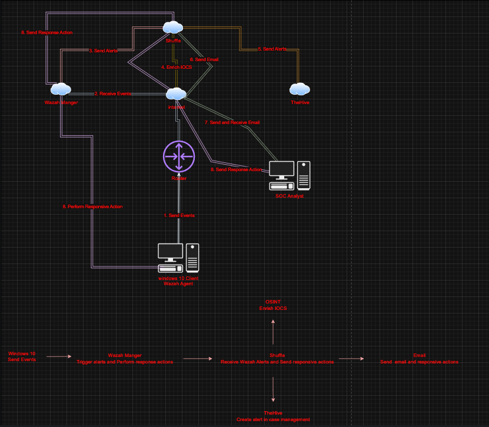
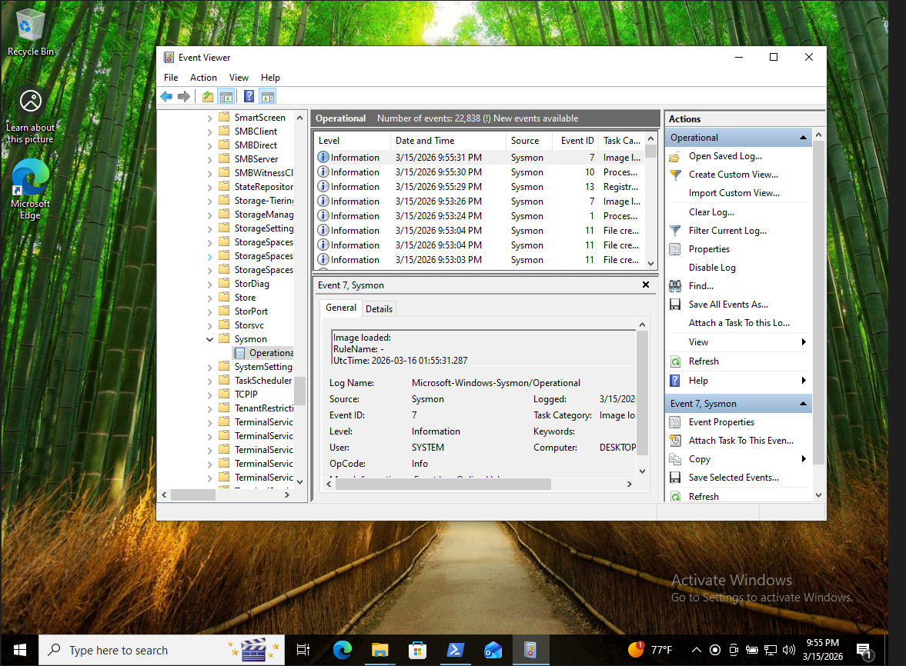

# SOC Automation Homelab

## Overview

This project demonstrates a simulated **Security Operations Center (SOC) pipeline** that detects malicious activity on a Windows endpoint and automatically performs investigation and incident creation using SOAR automation.

The lab integrates several open-source security tools to simulate a real SOC workflow. When suspicious activity occurs on an endpoint, telemetry is collected, analyzed, enriched with threat intelligence, and escalated into an incident response platform.

This project demonstrates how modern SOC teams combine **SIEM, endpoint monitoring, threat intelligence, SOAR automation, and case management** to respond to threats efficiently.

---

# Architecture

The SOC pipeline implemented in this lab:
Windows 10 Endpoint
->
Sysmon Telemetry
->
Wazuh SIEM
->
Shuffle SOAR Automation
->
VirusTotal Threat Intelligence
->
TheHive Incident Response
->
SOC Analyst Email Notification

Architecture diagram:

---

# Tools Used

| Tool | Purpose |
|-----|------|
| **Wazuh** | SIEM platform used for log collection and threat detection |
| **Sysmon** | Windows telemetry for monitoring system activity |
| **Shuffle** | SOAR platform used for automation workflows |
| **VirusTotal** | Threat intelligence enrichment |
| **TheHive** | Incident response case management platform |
| **Windows 10** | Endpoint used to simulate attack activity |

---

# Project Workflow

The project simulates a full SOC detection and response pipeline.

---

## 1. Endpoint Telemetry Collection

Sysmon is installed on a Windows 10 virtual machine to generate detailed telemetry including:

- Process creation
- File hashes
- Command execution
- System activity

Screenshot:

---

## 2. SIEM Log Ingestion

Wazuh collects telemetry generated by Sysmon and indexes it for security analysis.

Screenshot:

---

## 3. Endpoint Agent Connection

The Windows endpoint connects to the Wazuh SIEM using a Wazuh agent.

Screenshot:

---

## 4. Custom Detection Rule

A custom detection rule was created in Wazuh to detect **Mimikatz execution**.

Mimikatz is a credential dumping tool commonly used by attackers.

Detection rule example: Detect process creation where originalFileName = mimikatz.exe

Screenshot:

---

## 5. Attack Simulation

Mimikatz was executed on the Windows endpoint to simulate attacker behavior.

Screenshot:

---

## 6. Detection Alert Triggered

The custom Wazuh rule detects the malicious activity and generates a security alert.

Screenshot:

---

## 7. SOAR Automation

When an alert is generated, it is automatically forwarded to **Shuffle** via webhook integration.

Shuffle performs automated analysis and enrichment.

Screenshot:

---

## 8. Hash Extraction and Threat Intelligence

Shuffle extracts the SHA256 hash from the alert and queries **VirusTotal** for threat intelligence data.

Screenshot:

Result:

---

## 9. Incident Creation in TheHive

After enrichment, Shuffle automatically creates a security alert in **TheHive**.

Screenshot:

---

## 10. SOC Analyst Notification

An email alert is sent to the SOC analyst to notify them of the detected threat.

Screenshot:

---

# MITRE ATT&CK Mapping

This simulated attack maps to the **MITRE ATT&CK framework**: T1003 – Credential Dumping

Tool used: Mimikatz

---

# Skills Demonstrated

This project demonstrates several core **SOC analyst skills**:

- SIEM deployment
- Endpoint telemetry collection
- Threat detection engineering
- Custom detection rule creation
- SOAR automation
- Threat intelligence enrichment
- Incident response workflow
- Security tool integration

---

# Author

San Saad 

