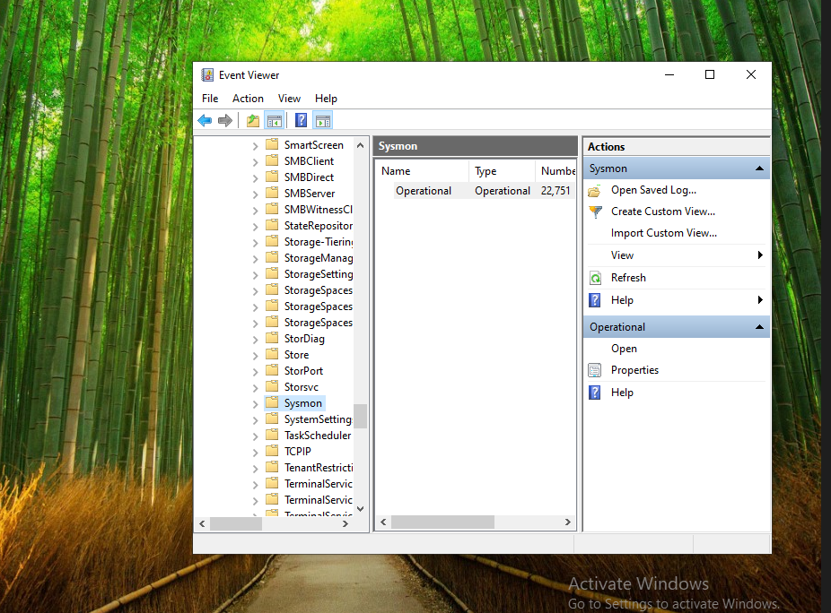
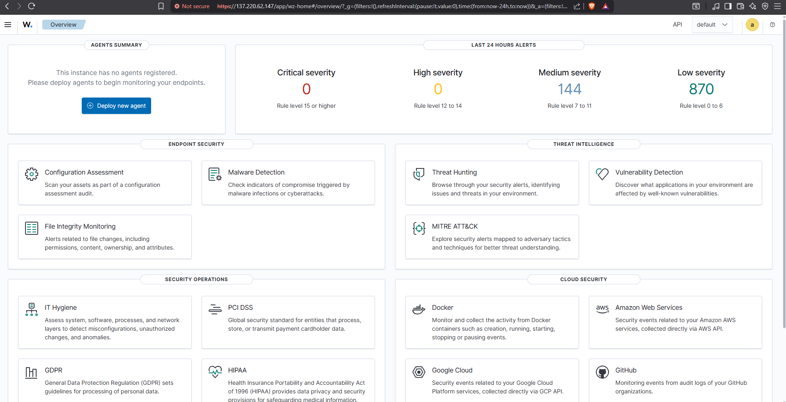
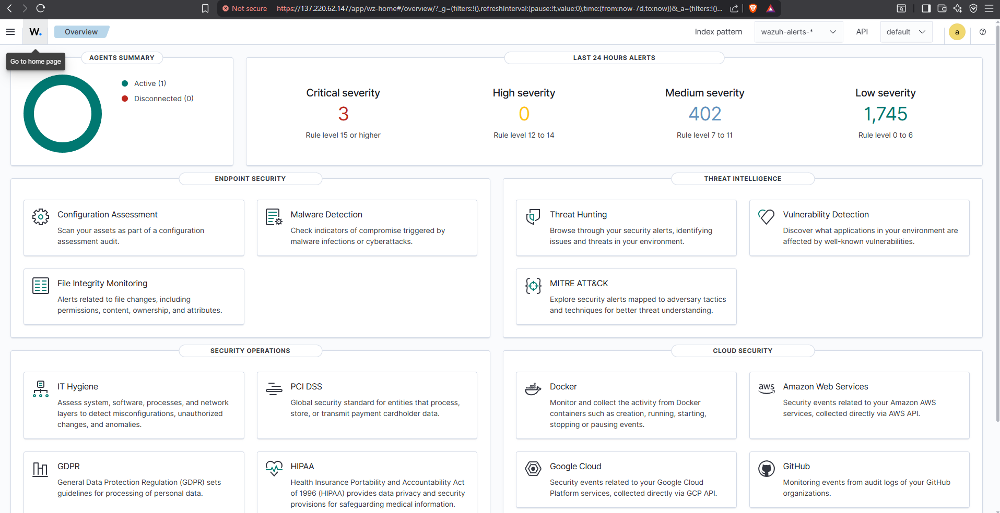
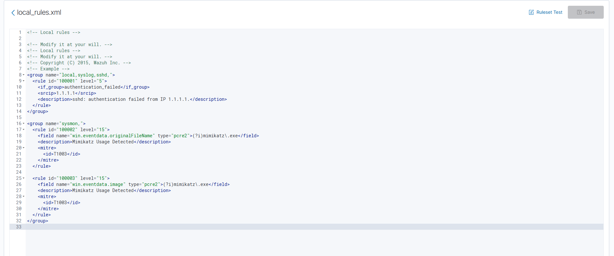
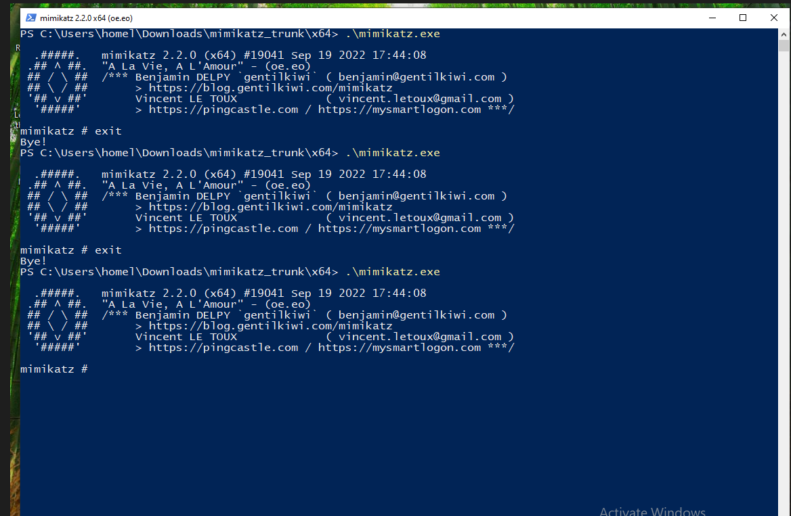
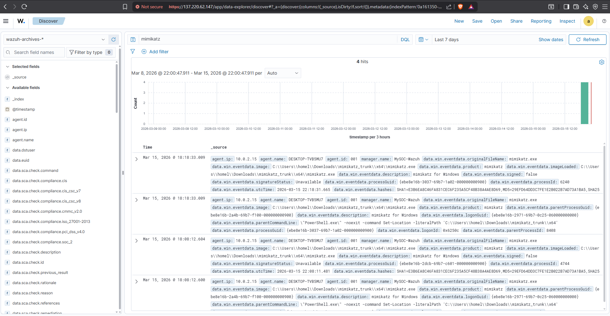
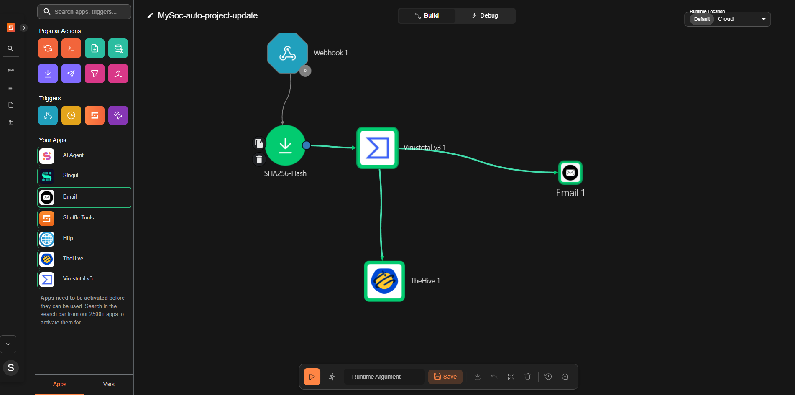
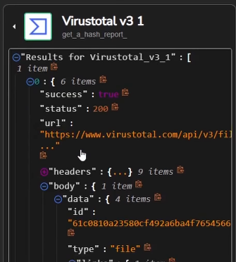
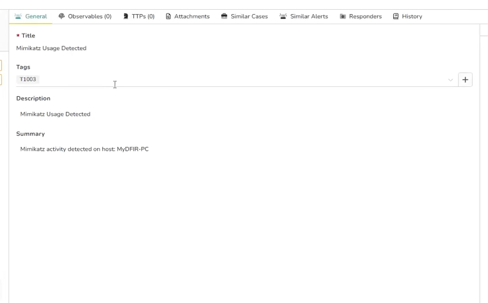
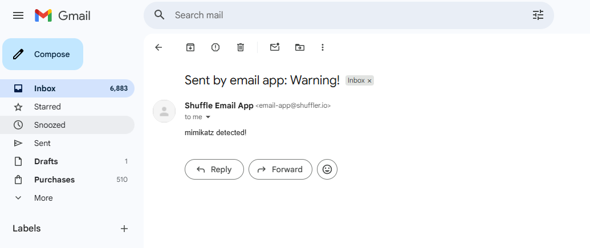

# SOC Automation Lab Walkthrough

## Lab Objective

The objective of this lab is to simulate a modern Security Operations Center (SOC) detection and response pipeline using open-source security tools.

The lab demonstrates how endpoint telemetry is collected, analyzed by a SIEM, enriched using threat intelligence, and escalated into an incident response platform through SOAR automation.

---

# Lab Environment

The environment used for this project includes:

| Component | Purpose |
|----------|---------|
| Windows 10 VM | Endpoint used to simulate attacker activity |
| Sysmon | Generates detailed endpoint telemetry |
| Wazuh | SIEM platform used for log collection and detection |
| Shuffle | SOAR automation platform |
| VirusTotal | Threat intelligence enrichment |
| TheHive | Incident response case management system |

---

# Step 1 – Virtual Lab Setup

A Windows 11 virtual machine was created using VirtualBox to simulate an endpoint device.

The endpoint is used to generate telemetry and simulate attacker behavior.

Screenshot:

---

# Step 2 – Install Sysmon

Sysmon was installed on the Windows endpoint to generate detailed system telemetry.

Sysmon provides visibility into:

- process creation
- network connections
- file hashes
- command execution

Installation command: sysmon -accepteula -i sysmonconfig.xml

Screenshot reference:

---

# Step 3 – Deploy Wazuh SIEM

Wazuh was deployed as the SIEM platform responsible for collecting and analyzing logs from the endpoint.

The Wazuh dashboard allows analysts to monitor alerts and security events.

Screenshot reference:

---

# Step 4 – Connect Endpoint Agent

A Wazuh agent was installed on the Windows endpoint to forward Sysmon telemetry to the SIEM.

Once the agent connects successfully, the endpoint appears in the Wazuh dashboard as an active agent.

Screenshot reference:

---

# Step 5 – Configure Detection Rule

A custom detection rule was created in Wazuh to detect the execution of **Mimikatz**, a credential dumping tool used by attackers.

Detection logic example:
Detect process creation where originalFileName = mimikatz.exe

Screenshot reference:

---

# Step 6 – Simulate Attack Activity

To test the detection pipeline, Mimikatz was executed on the Windows endpoint.

This simulated attacker behavior and generated Sysmon telemetry.

Screenshot reference:

---

# Step 7 – Detection Alert Triggered

The custom detection rule successfully detected the malicious activity and generated an alert inside the Wazuh SIEM.

Screenshot reference:

---

# Step 8 – SOAR Automation with Shuffle

Wazuh alerts are automatically forwarded to **Shuffle** using a webhook integration.

Shuffle automates the following tasks:

1. Extract SHA256 file hash from the alert
2. Query VirusTotal for threat intelligence
3. Create an alert in TheHive
4. Send a notification email to the SOC analyst

Screenshot reference:

---

# Step 9 – Threat Intelligence Enrichment

Shuffle extracts the file hash from the alert and queries **VirusTotal** to determine whether the file is malicious.

Screenshot reference:

---

# Step 10 – Incident Creation in TheHive

After enrichment, the alert is automatically sent to **TheHive**, where a case is created for investigation.

This allows SOC analysts to track incidents and perform further analysis.

Screenshot reference:

---

# Step 11 – SOC Analyst Notification

Finally, an email notification is sent to the SOC analyst informing them that suspicious activity has been detected.

Screenshot reference:

---

# Detection Workflow Summary

The project demonstrates the following security workflow:

Endpoint Activity → SIEM Detection → SOAR Automation → Threat Intelligence Enrichment → Incident Response → Analyst Notification

---

# MITRE ATT&CK Technique

The simulated attack corresponds to the MITRE ATT&CK technique:
T1003 – Credential Dumping

Tool used:
Mimikatz

---

# Skills Demonstrated

This project demonstrates several important SOC analyst skills:

- SIEM deployment and configuration
- Endpoint telemetry collection
- Threat detection engineering
- Custom detection rule creation
- SOAR automation workflows
- Threat intelligence enrichment
- Incident response case management
- Security tool integration

---

# Conclusion

This lab demonstrates how multiple security tools can be integrated into a working SOC pipeline capable of detecting malicious activity and automatically escalating incidents for investigation.

The workflow replicates the core functionality of a real-world Security Operations Center environment.

